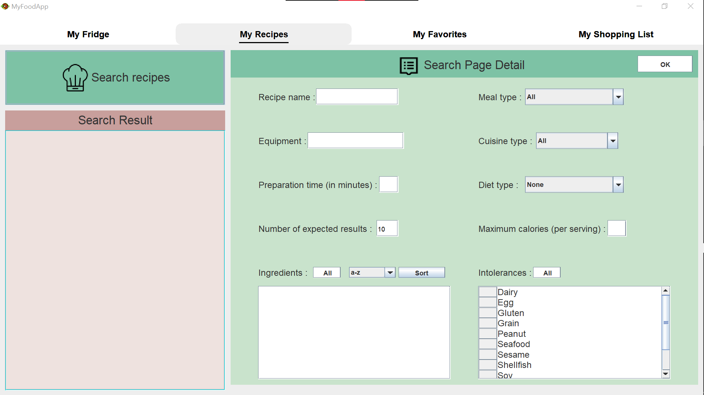

## Project INFO :

The goal of this project is to create an application that recommends 
recipes by analyzing the ingredients available in a person's refrigerator. 

         

## Completed features
- Register.
- Login.
- Logout.
- CRUD for ingredients in fridge.
- CRUD for recipes.
- CRUD for selections.
- CRUD for shopping list.
- Sort ingredient alphabetically or by expiration date.
- Search for recipes by : recipe name, equipement, meal type, cuisine type, preparation time, number of expected results, ingredients, meal type, cuisine type, diet type, maximum calories, intolerances.
- Show recipes with their content.
- Create a shopping list by comparing the ingredients present in the user's refrigerator with those required for the selected recipes.
- download shopping list.
### PS: CRUD == Create,Read(select),Update,Delete.

## Other features to be added.
- Send notification to users when and ingredient's deadline is close.
- show the nutritional intake for suggested recipes.

## :two_men_holding_hands: Project's team

